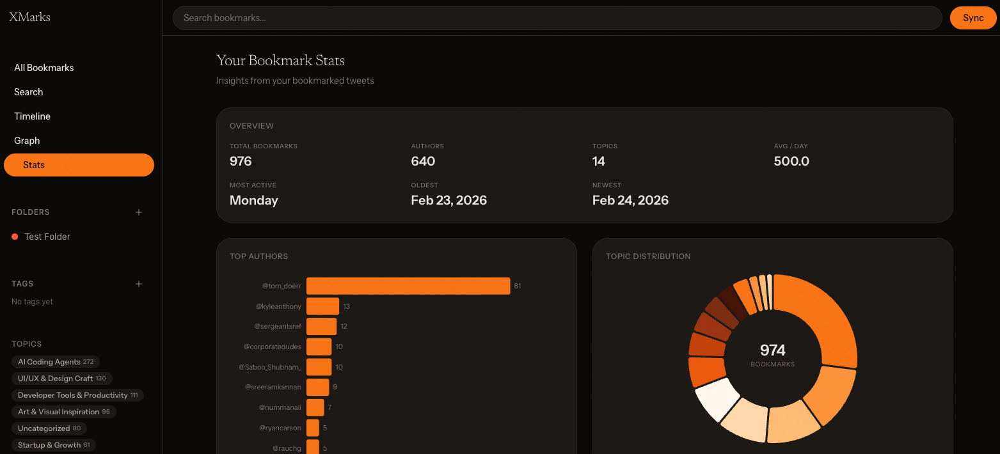

<p align="center">
  
</p>

<h1 align="center">XMarks</h1>

<p align="center">
  <strong>Your X bookmarks, organized and visualized.</strong><br/>
  A local-first bookmark intelligence platform built with Next.js and SQLite.
</p>

<p align="center">
  <a href="https://github.com/serrrfirat/xmarks/blob/main/LICENSE"></a>
  <a href="https://github.com/serrrfirat/xmarks/stargazers"></a>
  
  
</p>

<p align="center">
  <a href="#features">Features</a> &middot;
  <a href="#getting-started">Getting Started</a> &middot;
  <a href="#architecture">Architecture</a> &middot;
  <a href="#development">Development</a> &middot;
  <a href="#contributing">Contributing</a>
</p>

<p align="center">
  
</p>

---

## What is XMarks?

XMarks turns your X (Twitter) bookmarks from a dumping ground into a personal knowledge base. Sync your bookmarks locally, explore connections between authors and topics through an interactive graph, track your reading patterns with stats, and find anything instantly with a keyboard-first spotlight search.

Everything runs locally. Your data stays on your machine in a SQLite database. No cloud. No subscriptions. No tracking.

## Features

| Feature | Description |
|---|---|
| **Bookmark Graph** | Interactive force-directed Canvas graph showing connections between authors and topics. Zoom, pan, drag, click to explore. |
| **Stats Dashboard** | D3.js-powered charts — top authors, topic distribution, interest evolution over time, engagement scatter, forgotten bookmarks. |
| **Author Profiles** | Click any author name to see their bookmarked tweets, top topics, engagement averages, and activity timeline in a slide-out sheet. |
| **Spotlight Search** | Press `Cmd+K` from anywhere. FTS5-powered full-text search across tweets and authors with sub-200ms response times. |
| **Weekly Digest** | At-a-glance summary of your bookmarking week — top topics, top authors, rising trends, week-over-week comparison. |
| **Timeline View** | Bookmarks grouped by date with an activity heatmap, so you can see when you bookmark most. |
| **Folders & Tags** | Organize bookmarks into folders and tag them for custom categorization. |
| **Topic Classification** | AI-powered semantic categorization of bookmarks into discoverable topics. |
| **Thread Detection** | Automatically groups bookmarked tweets that belong to the same conversation thread. |

## Getting Started

### Prerequisites

- [Bun](https://bun.sh) 1.0+
- An X (Twitter) account with bookmarks

### Setup

```bash
# Clone the repo
git clone https://github.com/serrrfirat/xmarks.git
cd xmarks

# Install dependencies
bun install

# Start the dev server
bun dev
```

Open [http://localhost:3000](http://localhost:3000) and sync your bookmarks to get started.

### Database

XMarks stores all data locally in `~/.xmarks/db.sqlite`. The database is created automatically on first run. No external database setup required.

## Architecture

```
xmarks/
├── src/
│   ├── app/                    # Next.js App Router
│   │   ├── api/                # API routes (graph, stats, authors, digest, spotlight, ...)
│   │   ├── graph/              # Interactive bookmark graph page
│   │   ├── stats/              # Statistics dashboard page
│   │   ├── timeline/           # Timeline view with activity heatmap
│   │   └── search/             # Full-text search page
│   ├── components/
│   │   ├── graph-canvas.tsx    # D3 force-directed Canvas graph (dynamic import, no SSR)
│   │   ├── stats/              # 6 D3 chart components (bar, donut, area, scatter, ...)
│   │   ├── author-sheet.tsx    # Slide-out author profile (shadcn Sheet)
│   │   ├── spotlight-search.tsx # Cmd+K command palette (cmdk)
│   │   ├── weekly-digest.tsx   # This-week summary card
│   │   ├── bookmark-card.tsx   # Tweet card with author click, thread view
│   │   ├── layout/             # Sidebar + Header
│   │   └── ui/                 # shadcn/ui primitives
│   └── lib/
│       ├── db.ts               # SQLite via bun:sqlite (local-first)
│       ├── search.ts           # FTS5 full-text search
│       ├── types.ts            # 27 TypeScript interfaces
│       └── ...                 # sync, classify, folders, tags
```

**Stack**: Next.js 16 &middot; React 19 &middot; Bun &middot; SQLite (bun:sqlite) &middot; D3.js (selective modules) &middot; cmdk &middot; shadcn/ui &middot; Tailwind CSS 4

### Design Decisions

- **Canvas over SVG** for the graph — handles 600+ nodes at 60fps
- **D3 for math, React for DOM** — chart components use `useMemo` for D3 scales, React for SVG rendering
- **FTS5 for search** — SQLite's full-text search with prefix matching, no external search engine
- **No full `d3` package** — only `d3-force`, `d3-zoom`, `d3-scale`, `d3-selection`, `d3-shape` (~36KB total)
- **`structuredClone()`** before passing data to d3-force — D3 mutates node objects, this protects React state
- **`next/dynamic` with `ssr: false`** for all D3 components — D3 requires browser APIs

## Development

### Prerequisites

- [Bun](https://bun.sh) 1.0+
- [Node.js](https://nodejs.org) 20+ (for Next.js tooling)

### Commands

```bash
bun install              # Install dependencies
bun dev                  # Start dev server (http://localhost:3000)
bun run build            # Production build
bun run lint             # ESLint
bunx tsc --noEmit        # Type check
```

### API Routes

| Route | Description |
|---|---|
| `GET /api/graph` | Graph nodes (authors + topics) and edges |
| `GET /api/stats` | Aggregated statistics (6 sections) |
| `GET /api/authors/[handle]` | Author profile + bookmarked tweets |
| `GET /api/digest` | This week's bookmark summary |
| `GET /api/spotlight?q=` | FTS5 search for tweets + authors |
| `GET /api/timeline` | Bookmarks grouped by date |
| `GET /api/bookmarks` | Paginated bookmark list |

## Privacy

XMarks is local-first by design. Your bookmarks, reading patterns, and all derived data stay in a SQLite file on your machine (`~/.xmarks/db.sqlite`). No telemetry. No analytics. No cloud sync. The app runs entirely on `localhost`.

## Contributing

See [CONTRIBUTING.md](CONTRIBUTING.md) for guidelines.

## License

[MIT](LICENSE)
